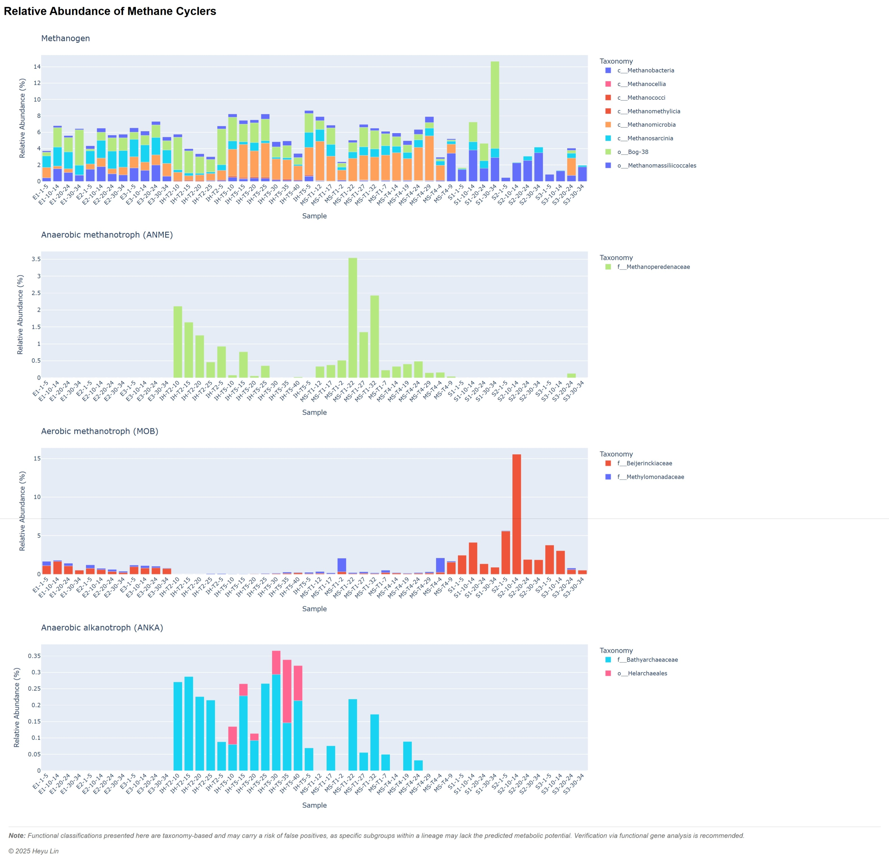

# MethanoHunt

A Python script to summarize the relative abundance of methane cyclers from taxonomic profiling data.

## Overview

MethanoHunt processes taxonomy tables from metagenomic profilers (like singleM) and calculates the relative abundance of different methane metabolism groups. It generates both tabular results and interactive visualizations.

## Installation

Requires Python 3.6+ with dependencies:
```bash
# environment setup
pip install pandas natsort plotly

# download the repository
cd /my/software/
git clone https://github.com/SilentGene/MethanoHunt.git
```

## Usage

```bash
python /my/software/MethanoHunt/methanohunt.py -i <input_files> [-db <database>] -o <output_tsv>
```

### Arguments

- `-i, --input` (required): Input tax.tsv files. Supports glob patterns (e.g., `*.tax.tsv`)
- `-db, --database` (optional): Path to MethanoHunt database file. Default: [methanohunt_db.tsv](methanohunt_db.tsv) in script directory
- `-o, --output` (required): Output TSV file path. Also generates an interactive HTML chart

### Example

```bash
python methanohunt.py -i singleM_results/*.tax.tsv -o methanohunt_results.tsv
```

## Output

- **TSV file**: Relative abundance (%) for each methane cycler group per sample
- **HTML file**: Interactive stacked bar chart grouped by classification

Here is an example of the output [methanohunt_output.html](example_output.html).

Screenshot of the interactive chart:


## Database Format

The [TSV database file](methanohunt_db.tsv) will be downloaded with the script. It contains the following columns:

- `GTDB_taxonomy`: Taxonomic identifier
- `Subgroup`: Metabolic subgroup
- `Classification`: Functional classification
- `Exception_taxonomy` (optional): Comma-separated taxa to exclude

> You can customize the database by editing this TSV file.

## A example workflow from raw reads to MethanoHunt results

Say you have 10 metagenomic samples in paried-end FASTQ format, with filenames like `sample1_R1.fastq.gz` / `sample1_R2.fastq.gz`, `sample2_R1.fastq.gz` / `sample2_R2.fastq.gz`, ..., `sample10_R1.fastq.gz` / `sample10_R2.fastq.gz`.

**Step 1**: Run singleM to generate taxonomic profiles

> You don't need to trim or QC the reads before running singleM

```bash
cd /my/raw_reads/  # change to the directory with your FASTQ files
SAMPLES=$(ls *_R1.fastq.gz | sed 's/_R1.fastq.gz//')
conda activate singlem  # activate your singleM conda environment

mkdir -p ../singleM_results  # create singleM output directory

# Run singleM for each sample
for SAMPLE in $SAMPLES; do
    singlem pipe -1 ${SAMPLE}_R1.fastq.gz -2 ${SAMPLE}_R2.fastq.gz --threads 4 \
    --taxonomic-profile ../singleM_results/"$SAMPLE"_singlem.tax.tsv \
    --taxonomic-profile-krona ../singleM_results/"$SAMPLE"_singlem.tax-krona.html \
    --otu-table ../singleM_results/"$SAMPLE"_singlem.otu.tsv
done
```

**Step 2**: Run MethanoHunt on the generated taxonomic profiles

```bash
mkdir -p ../methanohunt_results  # create MethanoHunt output directory
cd ../methanohunt_results
python /my/software/MethanoHunt/methanohunt.py -i ../singleM_results/*_singlem.tax.tsv -o methanohunt_results.tsv
```

## Notes

Taxonomy-based classifications may have false positives. Verification with functional gene analysis is recommended.

## Roadmap

Support for functional marker gene-based analysis

...🧙‍♂️🧬