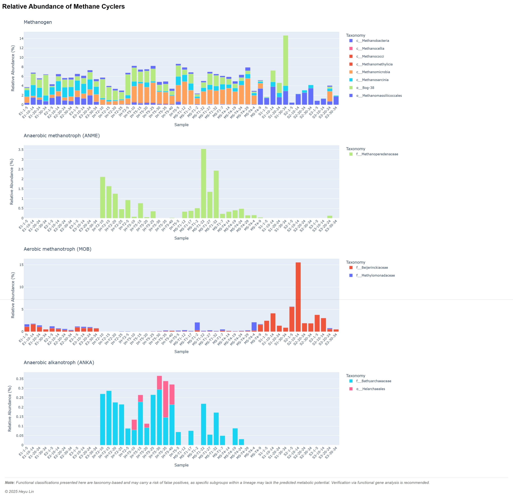

# MethanoHunt

A pipeline to profile methane cyclers from taxonomic profiling data or functional marker genes.

## Overview

MethanoHunt provides two main workflows:
1.  **Taxonomy**: Summarizes relative abundance of methane cyclers from taxonomic profiles (e.g. singleM).
2.  **Gene**: A pipeline to detect, classify, and quantify methane cycling marker genes (McrA, PmoA, MmoX) from protein sequences.

## Installation

### Dependencies
MethanoHunt requires:
*   Python 3.8+
*   Snakemake > 9.0
*   HMMER3
*   raxml-ng, epa-ng, gappa
*   Minimap2, Samtools
*   Python packages: `pandas`, `natsort`, `plotly`, `click`, `pysam`
*   PaPaRa (install independently)

Use conda to install all depencies except PaPaRa which needs another step.

```bash
git clone https://github.com/SilentGene/MethanoHunt.git
conda env create -f methanohunt.yaml
conda activate methanohunt
methanohunt setup  # to install PaPaRa
```

## Taxonomy Workflow
Analyze taxonomic abundance tables.

```bash
methanohunt taxonomy -i singleM_results/*.tax.tsv -o methanohunt_results
```

*   `-i`: Input taxonomy tables (supports glob patterns).
*   `-o`: Prefix for Output files. It will generate a TSV result and an HTML report.
*   `-db`: (Optional) Custom database path. If not provided, it will use the default database installed along with the pipeline.

Here is an example of the output (methanohunt_output.html)[example_output.html].

Screenshot of the interactive chart:


### Database Format

The [TSV database file](methanohunt_db.tsv) will be downloaded with the script. It contains the following columns:

- `GTDB_taxonomy`: Taxonomic identifier
- `Subgroup`: Metabolic subgroup
- `Classification`: Functional classification
- `Exception_taxonomy` (optional): Comma-separated taxa to exclude

> You can customize the database by editing this TSV file.

### A example workflow from raw reads to MethanoHunt results

Suppose you have 10 paired-end metagenomic samples in FASTQ format with filenames like `sample1_R1.fastq.gz`/`sample1_R2.fastq.gz`, `sample2_R1.fastq.gz`/`sample2_R2.fastq.gz`, and so on.

**Step 1**: Run singleM to generate taxonomic profiles

> You don't need to trim or QC the reads before running singleM

```bash
cd /my/raw_reads/  # change to the directory with your FASTQ files
SAMPLES=$(ls *_R1.fastq.gz | sed 's/_R1.fastq.gz//')  # get sample names
conda activate singlem  # activate your singleM conda environment

mkdir -p ../singleM_results  # create singleM output directory

# Run singleM for each sample
for SAMPLE in $SAMPLES; do
    singlem pipe -1 ${SAMPLE}_R1.fastq.gz -2 ${SAMPLE}_R2.fastq.gz --threads 4 \
    --taxonomic-profile ../singleM_results/"$SAMPLE"_singlem.tax.tsv \
    --taxonomic-profile-krona ../singleM_results/"$SAMPLE"_singlem.tax-krona.html \
    --otu-table ../singleM_results/"$SAMPLE"_singlem.otu.tsv
done
```

**Step 2**: Run MethanoHunt on the generated taxonomic profiles

```bash
mkdir -p ../methanohunt_results  # create MethanoHunt output directory
cd ../methanohunt_results
python /my/software/MethanoHunt/methanohunt.py -i ../singleM_results/*_singlem.tax.tsv -o methanohunt_results.tsv
```

### Notes

Taxonomy-based classifications may have false positives. Verification with functional gene analysis is recommended.


## Gene Workflow
Analyze functional genes from protein sequences.

Example:

**Classify genes and build phylogenetic trees with reference sequences**
```bash
methanohunt gene --prot assembly_genes.faa -o my_results --tree
```

**With abundance calculation (requires nucleotide genes and reads):**
```bash
methanohunt gene \
    --prot assembly_genes.faa \
    --nucl assembly_genes.ffn \
    -1 sample_R1.fq.gz -2 sample_R2.fq.gz \
    -o my_results \
    --marker McrA,PmoA,MmoX \
    --tree \
    --threads 8
```

*   `--prot`: Input protein FASTA (.faa).
*   `--nucl`: (Optional) Corresponding gene nucleotide FASTA (.ffn), required for abundance.
*   `-1`, `-2`: (Optional) Reads for abundance quantification. Support multiple files or glob patterns (e.g., `*.fq.gz`). You can rely on shell expansion (e.g. `2015*_1.fq.gz`).
*   `-o`: Output directory.
*   `--marker`: (Optional) Marker genes to analyze. Default is McrA,PmoA,MmoX.
*   `--tree`: (Optional) Build phylogenetic trees together with reference markers using fasttree. Default is False.
*   `-db`: Database folder. Default is the database folder included in the package.

## Output

### Gene Module Output

**Important results:**

*   `methanohunt_gene_classification.tsv`: Detected genes and their functional classification.
*   `MethanoHunt_report.html`: Abundance visualization (RPKG based).
*   `RPKG/`: RPKG abundance tables (classified, subtype, combined).
*   `classified_sequences/`: Detected sequences and their functional classification in fasta format.
*   `tree/`: Phylogenetic trees of detected sequences (if --tree is specified).

**Other results:**

*   `bam/`: Mapping results and reference.
*   `microbecensus/`: Genome equivalent estimation results.
*   `hmm/`, `hits/`, `placement/`, `classification/`, Intermediate results.

## Database

The required database files for both taxonomy and gene modules are included in the package.

# Future plan 

- A `genome` module that can detect methane cyclers from genomes/metagenome-assembled genomes and estimate their relative abundance.


...🧙‍♂️🧬
