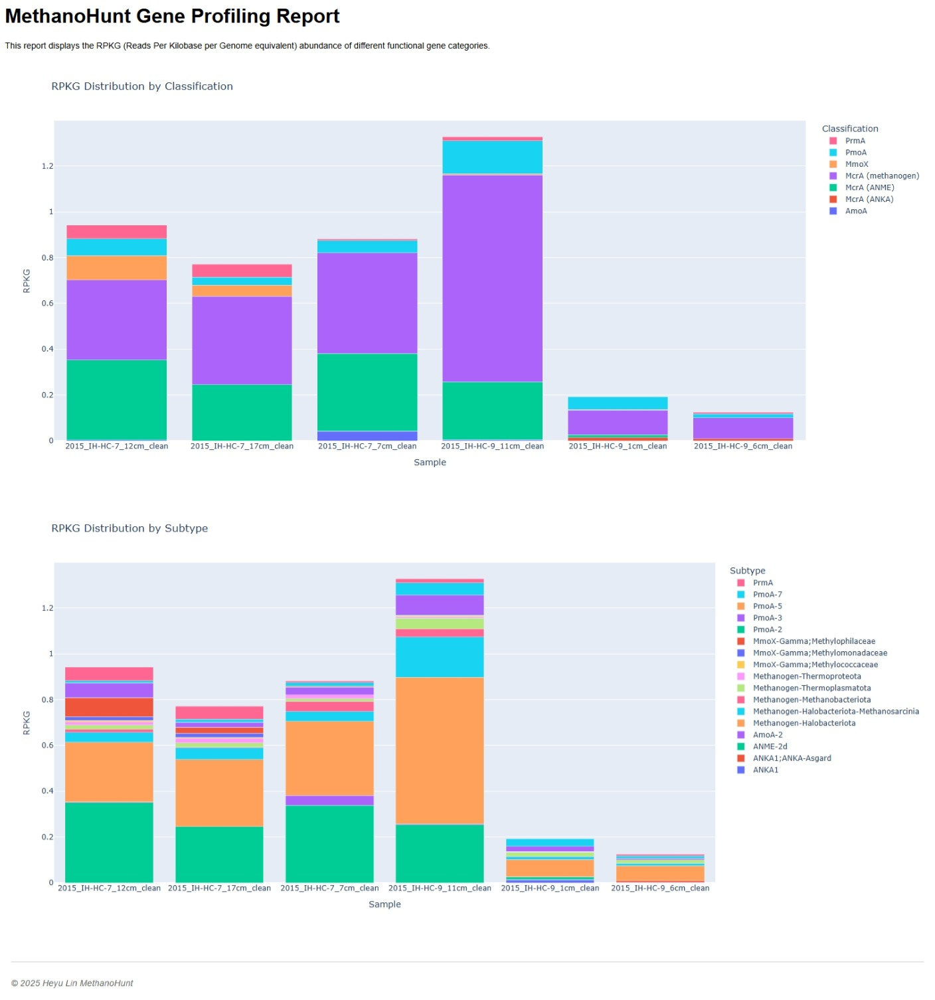

# MethanoHunt

A pipeline to profile methane cyclers from taxonomic profiling data or functional marker genes.

## Overview

MethanoHunt provides four handy workflows:
1.  [**Profile**](#profile-workflow): Summarizes relative abundance of methane cyclers from a taxonomic profiles (e.g. results from MetaPhlAn/SingleM/Sylph).
2.  [**Taxonomy**](#taxonomy-workflow): Find methane cyclers according to GTDB taxonomy.
3.  [**Gene**](#gene-workflow): A pipeline to detect, classify, and quantify methane cycling marker genes (McrA, PmoA, MmoX) from protein sequences.
4.  [**Genome**](#genome-workflow): A pipeline to detect and classify methane cyclers from genomes/metagenome-assembled genomes.

## Installation

### Dependencies
MethanoHunt requires:
*   Python 3.8+
*   Snakemake > 9.0
*   HMMER3
*   raxml-ng, epa-ng, gappa
*   Minimap2, Samtools
*   MicrobeCensus
*   Python packages: `pandas`, `natsort`, `plotly`, `click`, `pysam`
*   PaPaRa (install independently)

Use conda to install all depencies except PaPaRa which needs another step.

```bash
git clone https://github.com/SilentGene/MethanoHunt.git
conda env create -f methanohunt.yaml  # create a conda env named "methanohunt and install dependencies"
conda activate methanohunt
methanohunt setup  # to install PaPaRa
```

> [!NOTE]
> During the environment installation, you may see a message from `kofamscan` asking you to download its database from `ftp.genome.jp`. **Please ignore this message.** You do NOT need to download the official KOfam database, as MethanoHunt relies on its own curated databases.

## Profile Workflow
Analyze taxonomic abundance tables.

```powershell
$ methanohunt profile --help
Usage: methanohunt profile [OPTIONS]

  Run taxonomy-based profiling.

  Accepts either --input_wide or --input_long files.

Options:
  --input_wide TEXT     Input TSV profile file in wide format (first column:
                        taxonomy, rest: samples)
  --input_long TEXT     Input TSV profile file in long format with columns:
                        sample, taxonomy, relative_abundance
  -db, --database TEXT  Path to MethanoHunt database file
  -o, --output TEXT     Output directory path (will be created if not exists)
                        [required]
  -g, --group TEXT      Tab-separated file for grouping samples
                        (Sample\tGroup)
  --help                Show this message and exit.
```

### Input profile file format

MethanoHunt accepts two input profile file formats:

1. **Wide format**: (`--input_wide`) First column is taxonomy, rest are samples
2. **Long format**: (`--input_long`) Columns are sample, taxonomy, relative_abundance

<details>
  <summary>➡️ An example workflow from raw reads to MethanoHunt profile result via SingleM</summary>

Suppose you have 10 paired-end metagenomic samples in FASTQ format with filenames like `sample1_R1.fastq.gz`/`sample1_R2.fastq.gz`, `sample2_R1.fastq.gz`/`sample2_R2.fastq.gz`, and so on.

**Step 1**: Run singleM to generate taxonomic profiles

> You don't need to trim or QC the reads before running singleM

```bash
cd /my/raw_reads/  # change to the directory with your FASTQ files
SAMPLES=$(ls *_R1.fastq.gz | sed 's/_R1.fastq.gz//')  # get sample names
conda activate singlem  # activate your singleM conda environment

cd ..
mkdir -p singleM_results  # create singleM output directory

# Run singleM for each sample
for SAMPLE in $SAMPLES; do
    # Run singleM pipe for each sample
    singlem pipe -1 /my/raw_reads/${SAMPLE}_R1.fastq.gz -2 /my/raw_reads/${SAMPLE}_R2.fastq.gz --threads 4 \
        --taxonomic-profile singleM_results/"$SAMPLE"_singlem.tax.tsv \
        --taxonomic-profile-krona singleM_results/"$SAMPLE"_singlem.tax-krona.html \
        --otu-table singleM_results/"$SAMPLE"_singlem.otu.tsv
    # Summarise the taxonomic profile to get long format profile
    singlem summarise --input-taxonomic-profile singleM_results/"$SAMPLE"_singlem.tax.tsv \
        --output-taxonomic-profile-with-extras singleM_results/"$SAMPLE"_singlem.long.tsv
done

# Merge all the long format files
awk 'FNR==1 && NR>1 {next} NF>0' singleM_results/*_singlem.long.tsv > singleM_results/singleM_long_merged.tsv
```

**Step 2**: Run MethanoHunt on the generated taxonomic profiles

```bash

methanohunt profile --input_long singleM_results/singleM_long_merged.tsv -o methanohunt-profile_dir
```
</details>

<details>
  <summary>➡️ An example workflow from raw reads to MethanoHunt profile result via Sylph</summary>

  Suppose you have 10 paired-end metagenomic samples in FASTQ format with filenames like `sample1_R1.fastq.gz`/`sample1_R2.fastq.gz`, `sample2_R1.fastq.gz`/`sample2_R2.fastq.gz`, and so on.

**Step 1**: Run Sylph to generate taxonomic profiles

```bash
cd /my/raw_reads/  # change to the directory with your FASTQ files
SAMPLES=$(ls *_R1.fastq.gz | sed 's/_R1.fastq.gz//')  # get sample names
conda activate sylph  # activate your sylph conda environment

cd ..
mkdir -p sylph_results  # create sylph output directory

# run sylph
sylph profile $DB_DIR/gtdb-r226-c200-dbv1.syldb \
    -1 *_R1.fastq.gz \
    -2 *_R2.fastq.gz \
    -t $(nproc) \
    > sylph_results/sylph_profile.txt

# run sylph-tax
mkdir -p sylph_results/sylphmpa
sylph-tax taxprof sylph_results/sylph_profile.txt -t GTDB_r226 -o sylph_results/sylphmpa/

# merge results to wide format
sylph-tax merge sylph_results/sylphmpa/*.sylphmpa --column relative_abundance -o sylph_results/sylph-tax_profile.tsv
```

**Step 2**: Run MethanoHunt on the generated wide format taxonomic profiles

```bash

methanohunt profile --input_wide sylph_results/sylph-tax_profile.tsv -o methanohunt-profile_dir
```
</details>

> [!NOTE]
> Taxonomy-based classifications may have false positives. Verification with functional gene analysis is recommended.

## Taxonomy Workflow
Annotate taxonomic profiles with methane cycler information according to GTDB taxonomy.

Example:
```bash
methanohunt taxonomy -i MAG_classification.tsv -c Taxonomy -o methanohunt_annotate_results.tsv
```

*   `-i`: Input tsv file, including a column with taxonomic classification. This table MUST contain header.
*   `-c`: Column name of the taxonomic classification in the input tsv file.
*   `-o`: Output tsv file.
*   `-db`: (Optional) Custom database path. If not provided, it will use the default database installed along with the pipeline.

### Output

This workflow will generate a tsv file with the following two additional columns added to the input tsv file:

*   `MethanoHunt_classification`: methane cycling role
*   `MethanoHunt_subgroup`: methane cycling subgroup

## Gene Workflow
Analyze functional genes from protein sequences.

Example:

**Classify genes and build phylogenetic trees with reference sequences**
```bash
methanohunt gene --prot assembly_genes.faa -o my_results --tree
```

**With abundance calculation (requires nucleotide genes and reads):**
```bash
methanohunt gene \
    --prot assembly_genes.faa \
    --nucl assembly_genes.ffn \
    -1 sample_R1.fq.gz -2 sample_R2.fq.gz \
    -o my_results \
    --marker McrA,PmoA,MmoX \
    --tree \
    --threads 8
```

*   `--prot`: Input protein FASTA (.faa).
*   `--nucl`: (Optional) Corresponding gene nucleotide FASTA (.ffn), required for abundance.
*   `-1`, `-2`: (Optional) Reads for abundance quantification. Support multiple files or glob patterns (e.g., `*.fq.gz`). You can rely on shell expansion (e.g. `2015*_1.fq.gz`).
*   `-o`: Output directory.
*   `--marker`: (Optional) Marker genes to analyze. Default is McrA,PmoA,MmoX.
*   `--tree`: (Optional) Build phylogenetic trees together with reference markers using fasttree. Default is False.
*   `-db`: Database folder. Default is the database folder included in the package.

### Gene Module Output

**Important results:**

*   `methanohunt_gene_classification.tsv`: Detected genes and their functional classification.
*   `MethanoHunt_report.html`: Abundance visualization (RPKG based).
*   `RPKG/`: RPKG abundance tables (classified, subtype, combined).
*   `classified_sequences/`: Detected sequences and their functional classification in fasta format.
*   `tree/`: Phylogenetic trees of detected sequences (if --tree is specified).

**Other results:**

*   `bam/`: Mapping results and reference.
*   `microbecensus/`: Genome equivalent estimation results.
*   `hmm/`, `hits/`, `placement/`, `classification/`, Intermediate results.

Here is an example of the output (MethanoHunt_gene_report.html)[docs/MethanoHunt_gene_report.html].

Screenshot of the interactive chart:


### Genes that are able to be classified in this module
| Homologue   | KO     | Classification | Description                                   | Refs                                                                 | Note             |
|------------|--------|----------------|-----------------------------------------------|----------------------------------------------------------------------|------------------|
| McrA       | K00399 | Methanogen     | Anaerobic methanogenesis                      | [Chadwick et al., (2022)](https://doi.org/10.1371/journal.pbio.3001508) |                  |
| McrA       | K00399 | ANME           | Anaerobic methane oxidation                   | [Chadwick et al., (2022)](https://doi.org/10.1371/journal.pbio.3001508) |                  |
| McrA       | K00399 | ANKA           | Anaerobic alkane oxidation                    | [Chadwick et al., (2022)](https://doi.org/10.1371/journal.pbio.3001508) |                  |
| PmoA/AmoA  | K10944 | PmoA           | Aerobic methane oxidation (particulate)       | [Leu et al., (2025)](https://doi.org/10.1038/s41467-025-64223-2)       |                  |
| PmoA/AmoA  | K10944 | AmoA           | Aerobic ammonia oxidation                     | [Leu et al., (2025)](https://doi.org/10.1038/s41467-025-64223-2)       |                  |
| PmoA/AmoA  | K10944 | HMO            | Aerobic hydrocarbon oxidation                 | [Leu et al., (2025)](https://doi.org/10.1038/s41467-025-64223-2)       |                  |
| MmoX       | K16157 | MmoX           | Aerobic methane oxidation (soluble)           | [KEGG K16157](https://www.genome.jp/dbget-bin/www_bget?ko:K16157)      |                  |
| MmoX       | K16157 | PrmA           | Aerobic propane oxidation                     | [KEGG K16157](https://www.genome.jp/dbget-bin/www_bget?ko:K16157)      |                  |
| MmoX       | K16157 | MimA           | Aerobic alkane oxidation                      | [KEGG K16157](https://www.genome.jp/dbget-bin/www_bget?ko:K16157)      |                  |
| PhnJ       | K06163 | PhnJ           | Aerobic methanogenesis                        | [Boden et al., 2024](https://doi.org/10.1038/s41467-024-47914-0)       | To be implemented |


## Genome Workflow
Detect and classify methane cyclers from genomes/metagenome-assembled genomes.

Example:
```bash
methanohunt genome \
    --genome_dir my_genomes_fna_dir \
    --suffix fna \
    --threads 32 \
    --taxonomy_tsv my_genomes_taxonomy.tsv \
    --taxonomy_col GTDB_classification \
    --name_col bin_id \
    --output_dir methanohunt-genome_output
```

```powershell
$ methanohunt genome --help
Usage: methanohunt genome [OPTIONS]

  Run genome-based methane cycler classification.

Options:
  -i, --genome_dir TEXT    Input directory containing genome DNA FASTA files
  --faa_dir TEXT           Input directory containing genome protein FASTA
                           files (.faa)
  -s, --suffix TEXT        File extension suffix (e.g., fna, faa)  [required]
  -f, --taxonomy_tsv TEXT  TSV file containing genome taxonomy mapping
  -a, --name_col TEXT      Column name of the genome name in the input tsv
                           file
  -c, --taxonomy_col TEXT  Column name containing GTDB taxonomy in the
                           taxonomy file
  -t, --threads INTEGER    Number of threads to use (default: 8)
  --strict                 Use strict mode (requires If_key_in_enzyme to be
                           TRUE for KO mapping)
  --snake-args TEXT        Additional arguments to pass directly to snakemake
                           (e.g. '--unlock')
  -o, --output_dir TEXT        Output directory path (default:
                           methanohunt_genome_out)
  --help                   Show this message and exit.

```

### Output


## Database

The required database files for both taxonomy and gene modules are included in the package. Experts are welcome to edit the database files for your own needs.


...🧙‍♂️🧬
